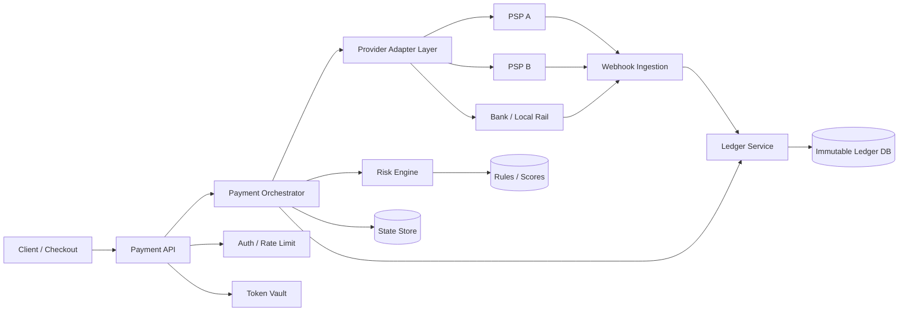

---
title: Payment Gateway Architecture
repo: system-design-for-founders
primary_keyword: Payments
secondary_keywords:
- System Design
- Security
- Distributed Systems
slug: payment-gateway-architecture
word_count_target: 1200
commit_type: 'architecture:'---

# Payment Gateway Architecture for Scalable and Secure Transactions

## Introduction

Payments are one of the most sensitive and failure-prone parts of a product stack. A payment gateway sits between your application, card networks, banks, wallets, and fraud systems, turning a user’s intent to pay into an authorized and settled transaction. For founders and CTOs, the right **Payments** architecture must balance reliability, compliance, latency, observability, and cost.

A weak design can cause double charges, missed webhooks, authorization failures, and chargeback exposure. A strong design supports multiple payment methods, regional processors, and recovery paths without exposing card data or creating brittle point-to-point integrations. This article outlines a practical **Payment Gateway Architecture** that works for modern products and scales with business growth.

## Problem Statement

Building a payment platform is not just about sending a charge request to a provider. Real-world **System Design** for payments must handle:

- Multiple payment methods: cards, wallets, bank transfers, ACH, and local rails
- Asynchronous outcomes: authorization, capture, refund, dispute, and settlement
- Idempotency and retries: network timeouts can create duplicate requests
- Provider variability: each PSP has different APIs, error codes, and webhook semantics
- Compliance requirements: PCI DSS, tokenization, audit logs, and data minimization
- Fraud and risk controls: velocity checks, device signals, and step-up verification
- High availability: payments cannot depend on a single region or single provider

Without a clear architecture, teams often embed provider logic directly inside application services. That creates tight coupling, poor testability, and difficult migrations. It also makes **Distributed Systems** issues visible in production: duplicate events, out-of-order webhooks, partial failures, and inconsistent ledgers.

## Solution

The recommended solution is to treat payments as a dedicated platform with clear boundaries:

1. **API Gateway / Payment API**
   - Receives payment intents, refunds, and status queries.
   - Validates authentication, request schema, and idempotency keys.

2. **Payment Orchestrator**
   - Owns the payment state machine.
   - Routes transactions to the right provider based on country, payment method, cost, or risk.

3. **Provider Adapter Layer**
   - Normalizes provider-specific behavior behind a common interface.
   - Handles retries, signature verification, and response mapping.

4. **Ledger Service**
   - Records every financial event immutably.
   - Separates authorization, capture, refund, fee, and settlement entries.

5. **Risk and Fraud Service**
   - Evaluates transactions before authorization or capture.
   - Uses rules, scorecards, and third-party signals.

6. **Webhook Ingestion Service**
   - Consumes asynchronous events from providers.
   - Deduplicates, validates, and updates internal state.

7. **Token Vault**
   - Stores payment tokens, not raw card numbers.
   - Keeps sensitive data outside general application databases.

A robust **Payments** flow should follow the payment intent model:

- Create intent
- Attach payment method token
- Authorize payment
- Capture payment
- Record ledger entries
- Listen for provider webhooks
- Reconcile settlement later

This separates user-facing actions from provider-side finality. It also lets you support retries and fallback routing without corrupting financial records.

## Architecture or Framework

A practical architecture for **Payment Gateway Architecture** is event-driven, stateful, and provider-agnostic.

### Core design principles

**1. Use a payment state machine**

Model each payment with explicit states such as:

- `created`
- `pending_authorization`
- `authorized`
- `captured`
- `failed`
- `refunded`
- `disputed`

This makes **Distributed Systems** behavior easier to reason about. Every transition should be idempotent and auditable.

**2. Separate command and event paths**

Commands come from your application: “authorize this card.”  
Events come from providers: “authorization approved.”

Use an append-only event log or durable queue between the orchestrator and downstream systems. This prevents request latency from depending on slow provider callbacks and supports replay during incidents.

**3. Enforce idempotency everywhere**

At minimum, apply idempotency keys to:

- Create payment intent
- Authorize payment
- Capture payment
- Refund payment

Store the key, request hash, and resulting state. If a client retries after a timeout, return the original result rather than creating a second charge.

**4. Keep a double-entry ledger**

A ledger should record balanced entries for every movement of money. Example:

- Customer payable
- Merchant receivable
- Processor fee expense
- Platform revenue

This is critical for reconciliation and audits. It also helps detect provider mismatches and settlement drift.

**5. Make webhook processing resilient**

Webhooks are often duplicated, delayed, or delivered out of order. Build a webhook pipeline that:

- Verifies signatures
- Deduplicates by event ID
- Stores raw payloads
- Processes asynchronously
- Replays safely

### Framework choices

For **System Design**, the implementation can vary, but the architecture should support:

- **API layer**: REST or gRPC for internal services, REST for external clients
- **Queues**: Kafka, SQS, or Pub/Sub for asynchronous processing
- **Datastore**: PostgreSQL for transactional records and ledger integrity
- **Cache**: Redis for idempotency keys and rate limiting
- **Secrets**: KMS-backed secret storage and encrypted token vaults
- **Observability**: OpenTelemetry, structured logs, and tracing

### Operational sequence

1. Client submits a payment request with an idempotency key.
2. Payment API validates the request and creates a payment intent.
3. Orchestrator checks risk rules and selects a provider.
4. Adapter sends authorization request to the PSP.
5. PSP responds synchronously or later via webhook.
6. Orchestrator updates payment state.
7. Ledger records the financial event.
8. Reconciliation jobs compare internal records with provider reports.

## Benefits

A well-designed payment platform provides measurable gains:

- **Higher authorization rates**: smart routing can improve approval by 1–5% depending on region and provider mix
- **Lower incident risk**: idempotency and state machines reduce duplicate charges and inconsistent states
- **Better compliance posture**: tokenization and data minimization reduce PCI scope
- **Faster provider migration**: adapter layers let you swap PSPs with less application rewiring
- **Improved reconciliation**: immutable ledger entries make settlement audits easier
- **Scalable reliability**: asynchronous workflows absorb provider latency and webhook bursts

For founders, the business impact is direct: fewer failed checkouts, lower support volume, and better recovery from provider outages. For CTOs, the architecture creates a maintainable boundary between product logic and financial infrastructure.

## Challenges

Even strong **Payments** architectures face difficult trade-offs.

### 1. Compliance and scope control
PCI DSS requirements can expand quickly if card data enters the wrong service. The safest approach is to keep raw PAN data out of your core stack and use hosted fields or tokenization.

### 2. Provider inconsistency
Each PSP handles retries, partial captures, and webhook timing differently. Your adapter layer must normalize behavior without hiding important provider-specific exceptions.

### 3. Exactly-once is unrealistic
In **Distributed Systems**, exactly-once delivery is hard to guarantee across networks and third parties. Design for at-least-once delivery with idempotent consumers instead.

### 4. Reconciliation complexity
A transaction may be authorized, captured, refunded, and later disputed. Settlement files may arrive hours or days later. Your ledger and reporting pipelines must support delayed truth.

### 5. Fraud versus conversion
Aggressive fraud checks reduce losses but can also block good customers. Teams need measurable policies, such as:

- Authorization rate
- Fraud rate
- Chargeback ratio
- Manual review rate
- False positive rate

### 6. Multi-region consistency
Active-active deployments improve availability but complicate state consistency. A common strategy is regional read/write ownership for payment intents, with replicated event streams and strict conflict handling.

## Future Opportunities

As payment infrastructure matures, several improvements can raise resilience and revenue:

- **Smart routing**: use historical approval data, issuer patterns, and cost rules to select the best PSP in real time
- **Adaptive fraud scoring**: combine device fingerprinting, behavioral signals, and account history to tune review thresholds
- **Network tokenization**: replace static card credentials with network-issued tokens to improve approval rates and reduce reissues
- **Unified payment orchestration**: support cards, ACH, RTP, SEPA, and wallets under one state model
- **Automated reconciliation**: match internal ledger entries with provider settlement files using machine learning-assisted matching
- **Event-driven finance ops**: feed payment events into analytics, support tooling, and revenue recognition systems

The next generation of **Payment Gateway Architecture** will be less about a single provider integration and more about orchestration across networks, regions, and risk systems. Teams that invest early in clean abstractions will adapt faster as payment methods and regulations evolve.

## Conclusion

A reliable payment platform is a financial system, not just an API integration. The best **Payments** architecture uses a payment intent model, a state machine, idempotent APIs, a double-entry ledger, and resilient webhook processing. It also isolates provider logic behind adapters so your product can change processors without rewriting core business flows.

For founders and CTOs, the main goal is not perfection; it is controlled failure. When a provider times out, a webhook arrives late, or a retry happens twice, the system should remain correct, auditable, and recoverable. That is the standard for production-grade **System Design** in payments.

## Related Reading

- (pending)