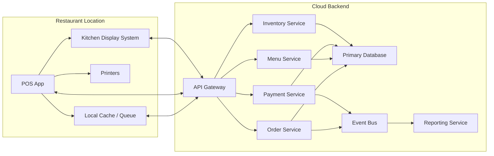

---
title: Restaurant POS System Design
repo: system-design-for-founders
primary_keyword: Architecture
secondary_keywords:
- System Design
- API Design
- Software Engineering
slug: restaurant-pos-system-design
word_count_target: 1200
commit_type: 'architecture:'---

# Restaurant POS System Design

## Introduction

A restaurant POS system design must balance speed, reliability, and operational clarity. Unlike many business applications, point-of-sale software sits on the critical path of revenue: every order, payment, modifier, discount, and receipt must work with minimal delay and high accuracy. For founders and CTOs, the **Architecture** of a restaurant POS is not just about screens and databases; it is about supporting table service, quick service, delivery, inventory sync, and payment compliance without slowing staff down.

A strong restaurant POS system design typically includes a cashier interface, kitchen display system (KDS), menu management, payment processing, reporting, and integrations with accounting or delivery platforms. The challenge is to keep the experience simple for staff while maintaining a scalable backend that can handle outages, peaks, and multi-location operations.

## Problem Statement

Restaurant operations create a unique mix of requirements that make POS software harder than standard CRUD applications.

First, the system must support real-time workflows. A server may open a table, split checks, add modifiers, void items, and send updates to the kitchen in seconds. Any lag creates operational friction. Second, the system must be resilient to connectivity issues. Many restaurants have unstable internet, but orders and payments still need to continue, especially during lunch and dinner rushes.

Third, the data model is complex. A single order may contain multiple items, discounts, taxes, service charges, tips, and partial payments. Inventory may need to decrement by ingredient, not by menu item. A restaurant POS system design also needs role-based access control for cashiers, managers, and kitchen staff, plus audit logs for refunds and voids.

Finally, integrations are non-negotiable. Payment gateways, receipt printers, kitchen printers, loyalty systems, online ordering, and accounting exports all require stable **API Design**. Poorly designed interfaces lead to brittle integrations and expensive maintenance.

## Solution

A practical solution is to design the POS as an event-driven platform with a clear separation between the client experience and backend services.

Start with a modular monolith or service-oriented backend, depending on team size. For early-stage products, a modular monolith often reduces complexity while preserving clean boundaries. Core domains should include:

- Order management
- Menu/catalog management
- Payments
- Kitchen routing
- Inventory
- Reporting and analytics
- User and permission management

The client applications should include:
- A tablet or touchscreen POS app for front-of-house staff
- A KDS app for kitchen stations
- An admin portal for managers and owners
- Optional customer-facing receipt or loyalty interfaces

For reliability, the POS client should maintain a local cache of menu data and active orders. If the network drops, the system should continue accepting orders and queue writes for later synchronization. This offline-first approach is especially important for table-service and peak-hour operations.

For payments, avoid storing card data directly. Integrate with PCI-compliant providers and use tokenization. The backend should record payment intents, authorization status, captures, refunds, and reconciliation events. This gives finance teams an audit trail and simplifies incident investigation.

For observability, instrument every major workflow: order creation latency, payment success rate, print failures, sync backlog, and KDS acknowledgment time. These metrics help operators identify whether the issue is the client app, backend, printer, or gateway.

## Architecture or Framework

A restaurant POS system design can be represented as a layered architecture with local resilience on the edge and centralized consistency in the cloud.

### Recommended framework

1. **Client layer**
   - Build the POS app with a cross-platform framework if you need rapid rollout across tablets and desktop.
   - Keep local persistence using SQLite or IndexedDB depending on platform.
   - Implement a sync engine that retries idempotent requests with conflict resolution.

2. **API layer**
   - Use REST for straightforward resources such as menus, orders, and users.
   - Use WebSockets or server-sent events for live KDS updates, order status changes, and sync acknowledgments.
   - Apply idempotency keys for payment and order submission endpoints.

3. **Domain services**
   - `Order Service`: handles order lifecycle, modifiers, splits, voids, and check management.
   - `Payment Service`: handles gateway communication, refunds, tips, tips adjustment, and reconciliation.
   - `Menu Service`: manages categories, item availability, pricing, and time-based menus.
   - `Inventory Service`: decrements ingredients based on recipe mappings.
   - `Reporting Service`: consumes events and builds operational dashboards.

4. **Data model**
   - Use a relational database for transactional integrity.
   - Model orders, order items, payments, refunds, shifts, and audit logs with strong constraints.
   - Use event tables or an event bus to track state transitions like `OrderCreated`, `ItemSentToKitchen`, and `PaymentCaptured`.

### Key design choices

- **Modular monolith vs microservices:** Start modular unless you have multiple teams and clear scaling pressure. Microservices can increase operational burden without improving restaurant workflows.
- **Offline-first sync:** Necessary for store continuity, but requires conflict handling for menu updates and order edits.
- **Event-driven reporting:** Avoid running heavy analytics on the transactional database.
- **Role-based access control:** Protect refunds, discounts, and cash drawer actions.

### Example APIs

- `POST /orders`
- `PATCH /orders/{id}`
- `POST /orders/{id}/send-to-kitchen`
- `POST /payments/intents`
- `POST /payments/{id}/capture`
- `POST /refunds`
- `GET /menus/current`
- `POST /sync/batch`

Good **API Design** here should prioritize idempotency, versioning, and clear error semantics. For example, a failed payment capture should return a machine-readable code that the POS app can retry or escalate.

## Benefits

A well-structured restaurant POS system design delivers measurable operational benefits.

- **Faster service:** Staff can complete order entry and payment with fewer taps, reducing average ticket time.
- **Higher reliability:** Offline-first behavior keeps the restaurant running during network interruptions.
- **Better reconciliation:** Clear payment states and audit trails reduce end-of-day cash discrepancies.
- **Improved kitchen throughput:** KDS routing and status updates reduce missed tickets and re-fires.
- **Scalable multi-location support:** Centralized menu and reporting systems make expansion easier.
- **Cleaner integrations:** Strong **Software Engineering** practices make it easier to add loyalty, delivery, and accounting systems.

Useful metrics to track include:
- Order creation latency
- Payment authorization success rate
- Order sync backlog
- Printer/KDS failure rate
- Refund frequency
- Average time to close check

These metrics reveal whether the product is helping operators or creating hidden friction.

## Challenges

The biggest challenge is consistency across offline and online states. If a cashier modifies an order while the backend is unavailable, the system must reconcile changes without duplicating charges or losing items. This is where conflict resolution rules become essential.

Another challenge is payment compliance. Even if your app never stores card numbers, your architecture must still protect sensitive data, limit access, and maintain auditability. PCI scope should be minimized through gateway tokenization and careful separation of concerns.

Hardware integration is also difficult. Receipt printers, cash drawers, barcode scanners, and kitchen devices often use inconsistent protocols. Your **System Design** should isolate device adapters behind stable interfaces so hardware changes do not affect business logic.

Restaurant menus are highly dynamic. Items may sell out, prices may change by location, and modifiers may vary by time of day. This means cache invalidation and menu versioning must be treated as first-class concerns.

Finally, operational support matters. A POS outage is visible immediately to staff and customers. You need structured logs, health checks, alerting, and a support playbook for order recovery, duplicate payment handling, and printer failures.

## Future Opportunities

Once the core POS is stable, the architecture can support higher-value capabilities.

One opportunity is predictive inventory and prep planning. By combining order history, time-of-day patterns, and ingredient consumption, the system can forecast demand and reduce waste.

Another is kitchen optimization. Event data can identify bottlenecks by station, ticket type, or menu item. This supports staffing and menu engineering decisions.

A third opportunity is unified commerce. The same backend can power in-store ordering, QR table ordering, web ordering, and third-party delivery integrations. This reduces duplication and keeps menu and pricing consistent.

You can also add loyalty, CRM, and personalized promotions. If the architecture already emits clean events, these features can subscribe without disrupting the core transaction path.

Longer term, AI-assisted forecasting, fraud detection, and dynamic staffing recommendations can be layered on top of the event stream. The key is to keep these capabilities downstream from the transactional core so they never slow the checkout flow.

## Conclusion

A restaurant POS system design succeeds when the **Architecture** supports speed at the counter, resilience during outages, and clarity for finance and operations. The best systems are not the most complex; they are the ones that make ordering, payment, and kitchen coordination predictable under real restaurant pressure.

For founders and CTOs, the practical path is clear: keep the transactional core simple, make the client offline-capable, design APIs for idempotency and integration, and use events for reporting and automation. That approach gives you a product that can start small and scale across locations without rewriting the foundation.

## Related Reading

- (pending)