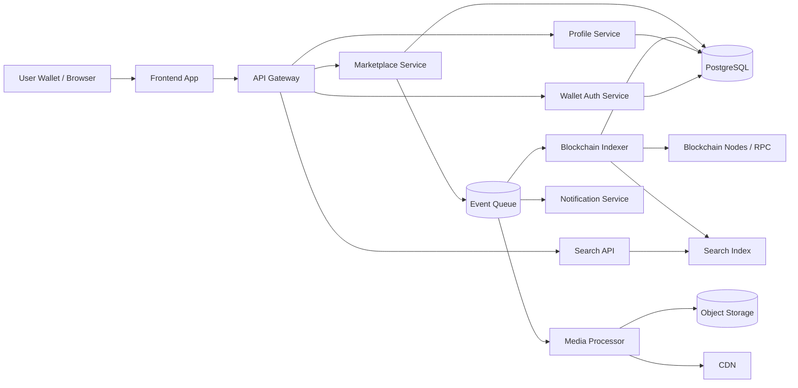

---
title: NFT Marketplace Architecture
repo: system-design-for-founders
primary_keyword: System Design
secondary_keywords:
- Scalability
- API Design
- Cloud
slug: nft-marketplace-architecture
word_count_target: 1200
commit_type: 'architecture:'---

# NFT Marketplace Architecture

## Introduction

Building an NFT marketplace is a practical exercise in **System Design** because it combines high-write transactional workloads, asset metadata handling, wallet authentication, blockchain event processing, and user-facing search and discovery. Founders and CTOs often focus on the minting flow first, but the real challenge is designing a platform that stays reliable when token volume, user activity, and chain events grow.

A strong NFT marketplace architecture must support three core experiences: browsing collections, buying or listing NFTs, and verifying ownership on-chain. It also has to handle off-chain concerns such as caching, indexing, fraud checks, media storage, and notifications. If any of these layers are weak, users will see stale listings, broken metadata, or failed purchases.

## Problem Statement

An NFT marketplace is not just a web app with blockchain calls. It is a distributed system with inconsistent data sources and strict correctness requirements. The main problems are:

1. **Blockchain latency and finality**  
   Transactions are not instant. A listing or sale may be visible in the app before it is finalized on-chain, or vice versa.

2. **Metadata reliability**  
   NFT metadata often lives on IPFS, Arweave, or external URLs. These sources can be slow, unavailable, or mutable if not pinned correctly.

3. **High read volume, bursty writes**  
   Most users browse collections, but mints, bids, and sales create spikes that can overwhelm naive backend designs.

4. **Ownership and state synchronization**  
   The marketplace must reconcile on-chain events with off-chain database records to avoid showing invalid listings or sold assets.

5. **Wallet-based identity and security**  
   Authentication is usually based on wallet signatures, which changes the API Design compared with password-based systems.

6. **Cloud cost and operational complexity**  
   Indexers, media processing, search, and event consumers can become expensive if the architecture is not controlled from the start.

For founders, the failure mode is usually the same: the product works in a demo, then breaks when multiple chains, collections, and users arrive.

## Solution

The best approach is a hybrid architecture: use the blockchain as the source of truth for ownership and settlement, and use off-chain services for speed, search, analytics, and user experience.

A practical solution includes:

- **Frontend app** for browsing, wallet connection, and transaction signing
- **API gateway** for request routing, auth, and rate limiting
- **Marketplace service** for listings, offers, bids, and order validation
- **Indexer service** that consumes blockchain events and updates internal state
- **Metadata service** that fetches, validates, and caches NFT metadata
- **Search service** for collection, trait, and owner queries
- **Media pipeline** for thumbnails, previews, and content moderation
- **Notification service** for bids, sales, and auction events
- **Relational database** for marketplace state
- **Object storage and CDN** for images and video previews
- **Message queue / event bus** for asynchronous workflows

The key design principle is separation of concerns: the chain confirms truth, while the application layer optimizes for user experience.

### Recommended request flow

1. User connects wallet and signs a nonce.
2. Backend verifies the signature and issues a session token.
3. User creates a listing or bid through the marketplace API.
4. Service writes the intent to the database and emits an event.
5. Blockchain transaction is submitted or monitored.
6. Indexer confirms the transaction and updates canonical marketplace state.
7. Search and cache layers are refreshed asynchronously.

This design reduces coupling and makes retries safer.

## Architecture or Framework

A reference architecture for NFT Marketplace Architecture can be modeled as event-driven microservices with a strong read-optimized layer.

### Core components

**1. API Gateway**  
Handles authentication, request throttling, and versioning. For strong **API Design**, expose separate endpoints for public reads and authenticated writes. Public endpoints should be cache-friendly and idempotent where possible.

**2. Wallet Auth Service**  
Implements nonce-based login with EIP-4361-style signed messages. Store nonce, expiration, and replay protection in Redis or PostgreSQL. This avoids account takeover through reused signatures.

**3. Marketplace Service**  
Owns listings, offers, auctions, and order validation. Use PostgreSQL for transactional integrity. Tables should include `listings`, `offers`, `orders`, `settlements`, and `asset_states`. Add unique constraints on `(chain_id, contract_address, token_id)` to prevent duplicate active listings.

**4. Blockchain Indexer**  
Consumes contract events such as `Transfer`, `OrderCreated`, `OrderFilled`, and `ListingCanceled`. This service should be idempotent and able to reprocess blocks after reorgs. Store block number, transaction hash, and log index for deduplication.

**5. Search and Discovery**  
Use Elasticsearch, OpenSearch, or a managed search engine for trait filters, collection ranking, and owner queries. Search should be eventually consistent, not transactionally coupled to the write path.

**6. Media and Metadata Pipeline**  
Fetch token metadata from IPFS gateways, HTTP URLs, or on-chain metadata. Normalize JSON, validate schema, generate thumbnails, and push assets to object storage. Serve through a CDN to reduce latency and origin load.

### Operational choices

- Use **PostgreSQL** for canonical marketplace records.
- Use **Redis** for session tokens, nonce storage, and hot caches.
- Use a queue such as **Kafka**, **SQS**, or **RabbitMQ** for asynchronous events.
- Use managed **Cloud** services to reduce operational burden early, especially for search, object storage, and queueing.
- Add observability from day one: logs, traces, and metrics.

### Metrics to watch

- Listing creation latency
- Transaction confirmation time
- Indexer lag in blocks and seconds
- Search freshness delay
- Cache hit ratio
- Failed signature verification rate
- RPC error rate
- Order fill mismatch rate

These metrics reveal whether your system is healthy or merely functional.

## Benefits

This architecture delivers several important advantages.

### Better scalability
Separating reads from writes allows the marketplace to serve high browse traffic without overloading transactional services. Cached collection pages and search indexes absorb most user traffic, which is essential for **Scalability**.

### Stronger correctness
By treating blockchain events as the source of truth for settlement, the system avoids showing impossible states for too long. Idempotent consumers and deduplication keys reduce double-processing.

### Faster product iteration
A modular backend lets teams add auctions, offers, royalties, or multi-chain support without rewriting the entire platform. Clear service boundaries also improve team ownership.

### Lower cloud risk
Using managed databases, queues, and storage reduces infrastructure complexity. This is especially useful when the team is small and needs to focus on product-market fit.

### Better API Design
A clean public API makes it easier to support web, mobile, partner integrations, and internal admin tools. Versioned endpoints and consistent error models reduce integration friction.

## Challenges

NFT marketplaces are difficult because many failures are subtle.

### Blockchain reorgs and eventual consistency
A transaction may appear confirmed and later be reorganized out of the chain. The indexer must support rollback or reconciliation jobs. Without this, users may see listings that no longer exist.

### Metadata instability
Some collections have broken URIs, missing attributes, or mutable metadata. The platform should cache normalized metadata, but also expose provenance and refresh controls.

### Gas costs and user experience
On-chain actions can be expensive or slow. You may need lazy minting, batch operations, or off-chain order signing to reduce friction. Each option adds complexity and security review.

### Fraud and spam
Bids, fake collections, wash trading, and bot activity can distort the marketplace. Rate limits, signature checks, allowlists, and anomaly detection are necessary.

### Multi-chain complexity
Supporting Ethereum, Polygon, Base, or other networks multiplies RPC, indexing, and settlement logic. Each chain has different finality and fee behavior, so chain abstraction must be deliberate.

### Cloud operational overhead
Search clusters, queues, and media pipelines can become expensive. Teams should define retention policies, cache TTLs, and index lifecycle rules early to control spend.

## Future Opportunities

Once the core marketplace is stable, the architecture can evolve in several directions.

### Multi-chain and cross-chain support
A chain-agnostic asset layer can let users browse and trade across networks with a unified interface. This requires standardized chain adapters and settlement workflows.

### Real-time personalization
With event streams and search telemetry, you can build recommendation systems for collectors, trending assets, and category-specific feeds. Keep these systems separated from core trade execution.

### Creator tooling
Add mint dashboards, royalty analytics, allowlist management, and floor-price alerts. These features increase retention and create new revenue paths.

### Better trust and compliance
Introduce content moderation, sanctions screening, and suspicious-wallet scoring. For enterprise or regulated markets, audit logs and policy workflows become critical.

### Data products
Marketplace data can power dashboards, APIs, and partner intelligence tools. A clean event model makes it easier to build analytics without impacting core transactions.

## Conclusion

A successful NFT marketplace architecture balances on-chain truth with off-chain performance. The best **System Design** is usually not the one that is most decentralized or the one with the most services. It is the one that clearly separates settlement, indexing, search, and user experience while remaining easy to operate.

For founders and CTOs, the practical path is to start with a transactional core, add an event-driven indexer, and keep read paths optimized through cache and search. Use managed **Cloud** services where possible, design APIs for idempotency, and measure indexer lag, confirmation time, and data freshness from the beginning. That combination gives you a marketplace that can survive real usage, not just a launch demo.

## Related Reading

- (pending)